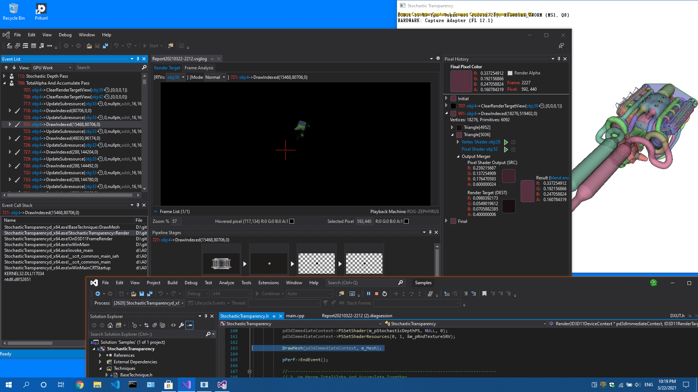

# Stochastic Transparency

The demo was originally the "StochasticTransparency" of the "NVIDIA SDK11 Samples"(9.[Bavoil 2011]). However, there are three fatal problems in the original code provide by the NVIDIA:  
- "Turning on MSAA in StochasticDepthPass is to random sample and the stochastic transparency intrinsically doesn't demand other passes to turn on the MSAA." The original code provided by the NVIDIA turns on the MSAA in all passes and thus the frame rate of the stochastic transparency is unexpectedly lower than the depth peeling. I turn off all the unnecessary MSAA and the frame rate increases from 670 to 1170 while the frame rate of deep peeling is 1070.  
- "The author use two separate passes AccumulatePass and TotalAlphaPass. However, we can totally merge them into a single pass." The original code provided by the NVIDIA follows the author and use two separate passes. I merge the separate passes and the frame rate increases from 1170 to 1370.  
- "The depth value used in AccumulatePass is the value of the shading position not the value of the sampling position. To be consistant, we prefer to write the depth (value of the shading position) to gl_FragDepth/SV_Depth in the fragment shader." The original code provided by the NVIDIA doesn't do this. However, the Alpha correction fixes the error well and there's little impaction on the effect.  

  
